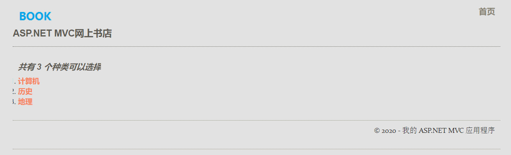
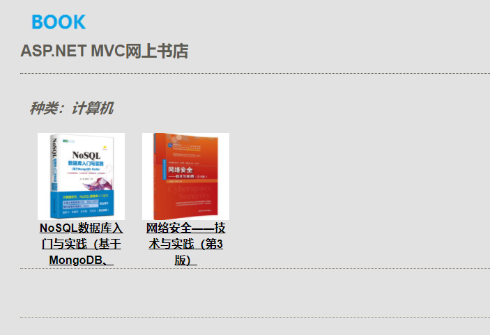
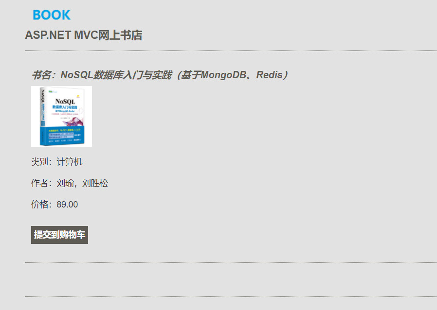

# BookStore
 

在线书店MVC版，是一个ASP.NET MVC 项目的基础版，采用库模式开发，拥有显示书籍列表、查看书籍详细信息、添加新书籍等基本功能。


## 0. 项目环境

|  项目   | 内容  |
|  :----:  | :----: |
| 开发工具  | VisualStudio 2019 |
| 前端语言  | Html+CSS+JavaScript |
| 后端语言  | C# |
| 项目框架  | ASP.NET MVC+Entity Framework 5 |
| 数据库  | Microsoft SqlServer 2012 |
| 服务器  | Microsoft IIS 6.0 |


## 1. 注意事项
### 1.1 项目导入
导入项目时需要修改web.config文件中“connectionStrings”节的内容。
```csharp
  <connectionStrings>
    <add name="MvcBookStoreEntities" connectionString="此处是自己配置生成的，需要修改" />
  </connectionStrings>
```
### 1.2 数据库导入
根目录下的dbo.sql文件包含结构和数据，直接导入数据库即可。

### 1.3 实体数据模型
使用EntityFrameWork生成实体数据模型时，代码生成器默认是“T4”，需要在视图上右键，点击“属性”，将其修改为“旧的ObjectContext”,并且删除Models文件夹下面的.tt文件。


## 2. 页面展示
BookShopLite 包含3个主要页面：图书列表页面、图书购买页面和购买详情页面，分别如下所示。
### 2.1 书籍类型列表页面
页面路由：Store/index


### 2.2 指定类型图书列表页面
页面路由：Store/Browse/id


### 2.3 图书详情页面
页面路由：Store/Details/id



## 3. 关于作者
作者：戴翔

电子邮箱：daixiangcn@outlook.com

GitHub: [Daixiangcn](https://github.com/Daixiangcn)

微信开发者主页： [软件大道](https://developers.weixin.qq.com/community/personal/oCJUswwS_u4S30Ibm2swAqvSjusw)

简介：中国公民，CSDN博客专家，社会公益组织指南针工作室志愿者，创业公司研发中心负责人，本科大四在读。第二届、第三届微信小程序应用开发大赛全国三等奖、华东赛区二等奖目作者，微信小程序《约车吗》、《庆云慈善会》、《锋云速检》项目总工程师。
